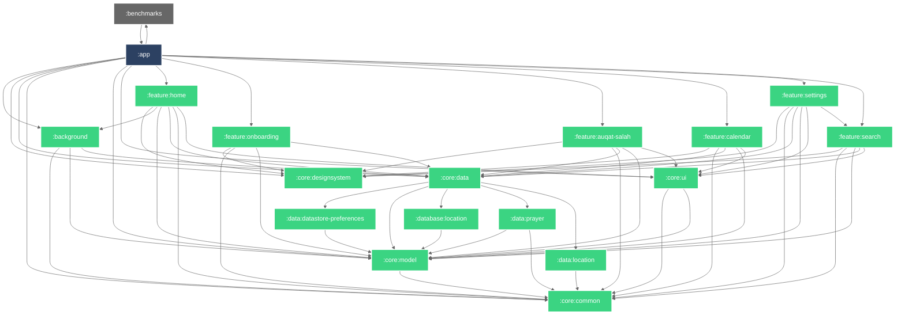

## Module Graph

```mermaid
%%{
  init: {
    'theme': 'neutral'
  }
}%%

graph TB
  :feature:calendar --> :core:designsystem
  :feature:calendar --> :core:common
  :feature:calendar --> :core:data
  :feature:calendar --> :core:model
  :feature:calendar --> :core:ui
  :data:prayer --> :core:model
  :data:prayer --> :core:common
  :benchmarks --> :app
  :database:location --> :core:model
  :feature:settings --> :core:designsystem
  :feature:settings --> :core:common
  :feature:settings --> :core:data
  :feature:settings --> :core:model
  :feature:settings --> :core:ui
  :feature:settings --> :feature:search
  :app --> :benchmarks
  :app --> :background
  :app --> :core:designsystem
  :app --> :core:data
  :app --> :core:common
  :app --> :core:model
  :app --> :core:ui
  :app --> :feature:home
  :app --> :feature:onboarding
  :app --> :feature:auqat-salah
  :app --> :feature:calendar
  :app --> :feature:settings
  :app --> :feature:search
  :core:model --> :core:common
  :background --> :core:common
  :background --> :core:model
  :background --> :core:data
  :feature:onboarding --> :core:designsystem
  :feature:onboarding --> :core:common
  :feature:onboarding --> :core:model
  :feature:onboarding --> :core:data
  :core:data --> :data:datastore-preferences
  :core:data --> :core:model
  :core:data --> :database:location
  :core:data --> :data:prayer
  :core:data --> :data:location
  :feature:home --> :core:designsystem
  :feature:home --> :background
  :feature:home --> :core:model
  :feature:home --> :core:data
  :feature:home --> :core:common
  :feature:home --> :core:ui
  :feature:search --> :core:designsystem
  :feature:search --> :core:common
  :feature:search --> :core:model
  :feature:search --> :core:data
  :feature:search --> :core:ui
  :data:location --> :core:common
  :feature:auqat-salah --> :core:designsystem
  :feature:auqat-salah --> :core:common
  :feature:auqat-salah --> :core:data
  :feature:auqat-salah --> :core:model
  :feature:auqat-salah --> :core:ui
  :core:ui --> :core:common
  :core:ui --> :core:model
  :data:datastore-preferences --> :core:model

classDef android-library fill:#3BD482,stroke:#fff,stroke-width:2px,color:#fff;
classDef unknown fill:#676767,stroke:#fff,stroke-width:2px,color:#fff;
classDef android-application fill:#2C4162,stroke:#fff,stroke-width:2px,color:#fff;
class :feature:calendar android-library
class :core:designsystem android-library
class :core:common android-library
class :core:data android-library
class :core:model android-library
class :core:ui android-library
class :data:prayer android-library
class :benchmarks unknown
class :app android-application
class :database:location android-library
class :feature:settings android-library
class :feature:search android-library
class :background android-library
class :feature:home android-library
class :feature:onboarding android-library
class :feature:auqat-salah android-library
class :data:datastore-preferences android-library
class :data:location android-library

```
