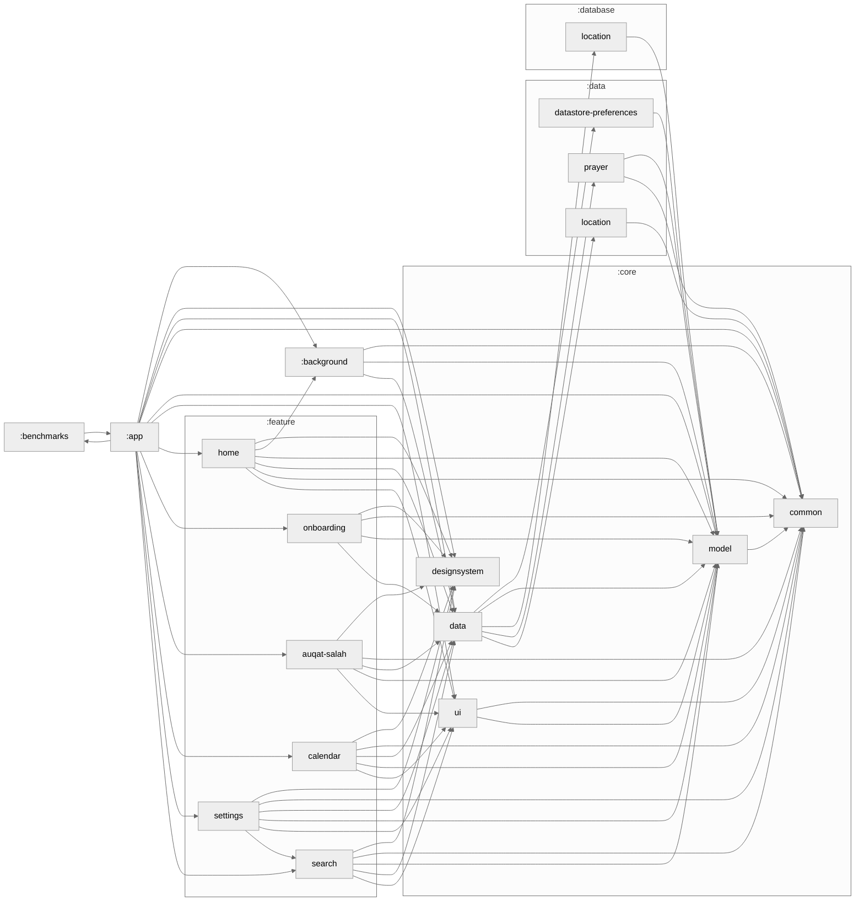

## Module Graph

```mermaid
%%{
  init: {
    'theme': 'neutral'
  }
}%%

graph LR
  subgraph :core
    :core:designsystem["designsystem"]
    :core:common["common"]
    :core:data["data"]
    :core:model["model"]
    :core:ui["ui"]
  end
  subgraph :data
    :data:prayer["prayer"]
    :data:datastore-preferences["datastore-preferences"]
    :data:location["location"]
  end
  subgraph :database
    :database:location["location"]
  end
  subgraph :feature
    :feature:calendar["calendar"]
    :feature:settings["settings"]
    :feature:search["search"]
    :feature:home["home"]
    :feature:onboarding["onboarding"]
    :feature:auqat-salah["auqat-salah"]
  end
  :feature:calendar --> :core:designsystem
  :feature:calendar --> :core:common
  :feature:calendar --> :core:data
  :feature:calendar --> :core:model
  :feature:calendar --> :core:ui
  :data:prayer --> :core:model
  :data:prayer --> :core:common
  :benchmarks --> :app
  :database:location --> :core:model
  :feature:settings --> :core:designsystem
  :feature:settings --> :core:common
  :feature:settings --> :core:data
  :feature:settings --> :core:model
  :feature:settings --> :core:ui
  :feature:settings --> :feature:search
  :app --> :benchmarks
  :app --> :background
  :app --> :core:designsystem
  :app --> :core:data
  :app --> :core:common
  :app --> :core:model
  :app --> :core:ui
  :app --> :feature:home
  :app --> :feature:onboarding
  :app --> :feature:auqat-salah
  :app --> :feature:calendar
  :app --> :feature:settings
  :app --> :feature:search
  :core:model --> :core:common
  :background --> :core:common
  :background --> :core:model
  :background --> :core:data
  :feature:onboarding --> :core:designsystem
  :feature:onboarding --> :core:common
  :feature:onboarding --> :core:model
  :feature:onboarding --> :core:data
  :core:data --> :data:datastore-preferences
  :core:data --> :core:model
  :core:data --> :database:location
  :core:data --> :data:prayer
  :core:data --> :data:location
  :feature:home --> :core:designsystem
  :feature:home --> :background
  :feature:home --> :core:model
  :feature:home --> :core:data
  :feature:home --> :core:common
  :feature:home --> :core:ui
  :feature:search --> :core:designsystem
  :feature:search --> :core:common
  :feature:search --> :core:model
  :feature:search --> :core:data
  :feature:search --> :core:ui
  :data:location --> :core:common
  :feature:auqat-salah --> :core:designsystem
  :feature:auqat-salah --> :core:common
  :feature:auqat-salah --> :core:data
  :feature:auqat-salah --> :core:model
  :feature:auqat-salah --> :core:ui
  :core:ui --> :core:common
  :core:ui --> :core:model
  :data:datastore-preferences --> :core:model
```
